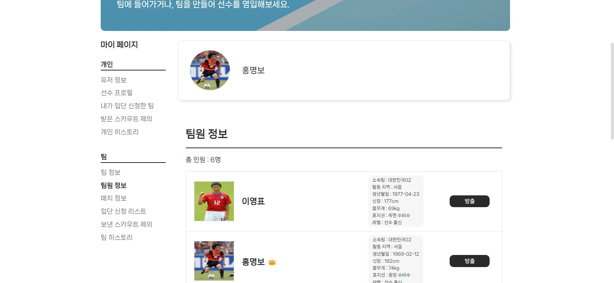

# Footballer

---

### ⚽ 풋살 • 축구 매칭 및 커뮤니티 서비스

- 풋살•축구를 좋아하는 사람들이 팀끼리 매칭을 잡거나, 서로 간의 교류를 할 수 있는 서비스입니다. 취미를 통해 좀 더 팀과 선수에 집중된 서비스를 만들고자 했습니다.
- 선수 등록, 팀 등록, 선수 영입, 입단 신청, 선수 찾기 등을 통해 매칭 서비스를 이용할 수 있습니다. 또한, 선수와 팀을 평가할 수 있고, 구장 정보 및 지도를 통해 위치까지 확인이 가능합니다.
  
### [배포 링크](https://footballer-eta.vercel.app/)

---

### 💿 주요 기술

- React
- TypeScript
- Emotion : 컴포넌트 별 스타일 관리
- Context API
- Kakao Map API
- Firebase Auth / Firestore Database : 로그인 및 회원가입 / 선수 / 팀 / 매치 / 컵 대회 / 구장 등의 실시간 데이터베이스

### 💿 주요 기능

- 메인 페이지
  

- 회원 가입 시 선수 등록 및 팀 등록
  
  

- 선수 및 팀 찾기를 통한 입단 신청 및 스카우트 제의
  

- 선수 및 팀 상세 페이지를 통한 정보 확인 및 평가 
  

- 마이페이지에서 선수 및 팀별 다양한 정보 확인
  
  

- 구장 리스트를 통해 구장 정보 및 지도를 통한 위치 확인
  

- 컵 대회 개최 참가 가능
  
